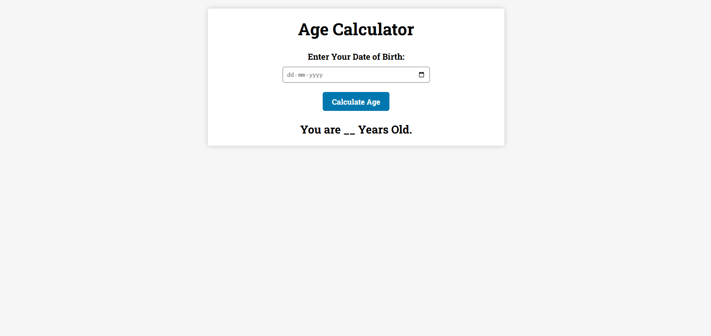

# 🎂 Age Calculator

A clean, minimal web app that calculates your exact age from your date of birth — built with vanilla HTML, CSS, and JavaScript.

   

---

## ✨ Features

- 📅 Pick any date of birth using a native date input
- ⚡ Instantly calculates your current age in years
- 🎯 Handles edge cases — correctly accounts for whether your birthday has passed this year
- 📱 Responsive layout — works on desktop and mobile
- 🎨 Clean UI with smooth hover animations

---

## 🚀 Getting Started

### Prerequisites

No dependencies or build tools required. Just a modern web browser.

### Installation

1. **Clone the repository**
   ```bash
   git clone https://github.com/dyaus99/age-calculator.git
   ```

2. **Navigate into the project folder**
   ```bash
   cd age-calculator
   ```

3. **Open `index.html` in your browser**
   ```bash
   open index.html
   # or just double-click the file
   ```

---

## 🗂️ Project Structure

```
age-calculator/
├── index.html      # App markup and structure
├── style.css       # Styling and layout
├── app.js          # Age calculation logic
└── icon.png        # Site favicon
```

---

## 🧠 How It Works

1. The user selects a date of birth from the date picker.
2. On clicking **Calculate Age**, the app compares the birth date against today's date.
3. It checks whether the birthday has already occurred this calendar year to ensure accuracy.
4. The result is displayed dynamically — e.g., *"You are 24 Years Old."*

---

## 🖼️ Preview

| Input | Result |
|-------|--------|
| Select your date of birth | Displays your age in years |

---

## 🛠️ Built With

- **HTML5** — Semantic structure
- **CSS3** — Flexbox layout, transitions, Google Fonts (Roboto Slab)
- **JavaScript (ES6)** — DOM manipulation, Date API

---


## 🙌 Acknowledgements

- Fonts by [Google Fonts](https://fonts.google.com/)
- Inspired by classic beginner JavaScript projects

---

> Made with ❤️ — feel free to fork, star ⭐, and improve!